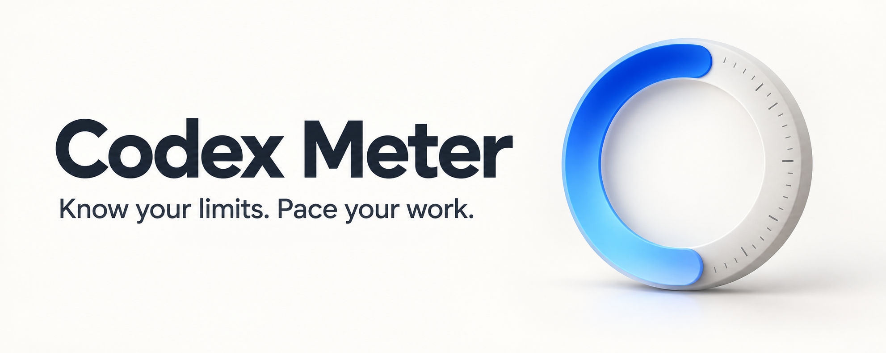
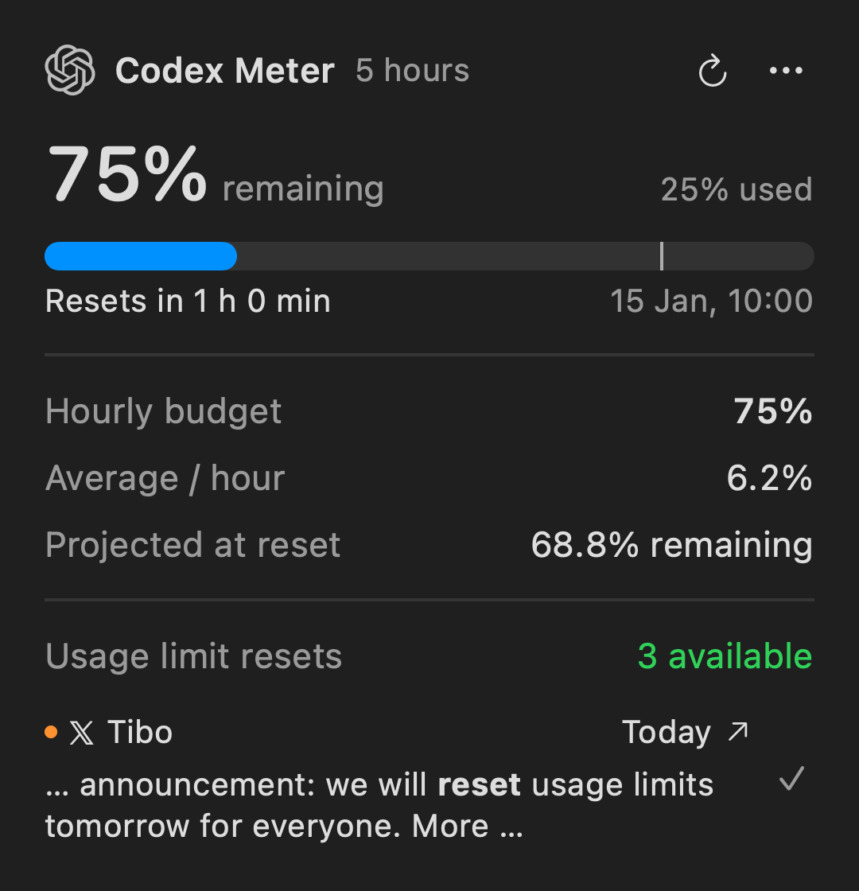

# Codex Meter

A small native macOS menu bar app for checking Codex usage and pacing the quota you have left.

- **At a glance:** a menu-bar ring with the consumed percentage inside, plus an optional ring-only mode.
- **One click:** remaining quota, reset countdown and exact reset time.
- **Plan your usage:** daily or hourly allowance, today's budget, average pace and estimated runway.
- **Reset announcements:** a compact link to Tibo’s latest post mentioning **reset**, with an unread indicator.
- **Stay up to date:** optional launch at login and quiet checks for new app releases.
- **Lightweight:** AppKit + SwiftUI, no external app dependencies. The Codex reader runs only during refreshes.



The preview shows version 0.5.1 with synthetic quota values and a fictional post, not actual account usage or a real statement by Tibo. The PNG is rendered directly at 4× resolution and displayed at a fixed width for crisp text. Reproduce it with `./scripts/test-ui.sh` (`.build/readme-demo.png`).

This is an independent project, not affiliated with OpenAI.

## Login & privacy

Sign in with the official Codex CLI using ChatGPT before opening Meter. You do not give Codex Meter an account, password or API key. The CLI account may be different from the account signed in to the Codex desktop app; Meter reads whichever account the CLI uses. API billing is outside Meter's scope.

Meter asks the locally launched CLI for quota and reset information through `account/rateLimits/read` over standard input/output, then closes that process. The app has no Meter backend or telemetry code. Usage snapshots stay in memory; only the selected quota window, ring-only display, automatic-update and reset-post preferences plus the last-read post ID are saved. Codex CLI manages its own network access, authentication and any logs it writes.

Meter can use a standalone Codex CLI or the CLI bundled with the Codex desktop app. It checks the desktop app directly if a standalone CLI path is unavailable, including when an app update leaves an old symlink behind.

The displayed percentages are quota points, not token counts. Budget allowance is remaining quota divided by time to reset; runway and reset projections assume the current average pace. These figures are not a history of actual usage or a measure of productivity.

## Install

You need an **Apple Silicon Mac**, macOS **13 or later**, and the **Codex CLI signed in with ChatGPT**.

1. Open the [latest release](https://github.com/emmepra/codex-meter/releases/latest) and download the **Apple Silicon ZIP** under **Assets**.
2. Unzip it and move **Codex Meter.app** to your Applications folder.
3. Open the app. No compiler or source checkout is needed.

The app is **ad hoc signed**, without an Apple Developer ID signature or notarization, so Gatekeeper may block the first launch. The [installation guide](docs/INSTALL.md#first-launch) explains Apple's **Open Anyway** procedure, along with [CLI setup](docs/INSTALL.md#install-codex-cli-and-sign-in), [building from source](docs/INSTALL.md#build-from-source-alternative), updates and troubleshooting.

### Updating an existing installation

Choose **Options → Check for Updates…** to open the latest release when a newer version is available. Download the ZIP, quit Meter, and replace the copy in Applications. Updates are installed manually.

From **0.5.0**, automatic checks can also light the blue menu-bar dot. It appears only for a **newer** version, so a development preview with the same version as the release will not show it. Older versions without an update command can use the [latest release page](https://github.com/emmepra/codex-meter/releases/latest).

## Use

Click the menu bar indicator to open the compact panel, anchored directly below the menu bar even when its content changes height. The ring shows **used quota**, with its percentage centered inside; **Ring only** hides that number. The larger percentage in the panel shows **remaining quota**. **Resets in** shows the time until the next reset.

The **Options** (`…`) menu contains **Ring only**, available quota windows, **Refresh**, **Check for Updates…**, **Open Repository** and **Quit**. Usage refreshes every three minutes and after wake; the arrow refreshes immediately. **Launch at Login** in Options enables the native macOS login item; it is off until you choose it. If macOS requires approval, use **Approve Launch at Login…**. Keep the app in Applications. Login launches stay in the menu bar without opening the panel.

**Usage limit resets** shows the number of banked resets available to the Codex CLI account, including a confirmed zero. A fresh count above one is green; one or zero is red. Out-of-date counts remain orange, while **Unavailable** stays neutral and does not mean zero. **Out of date** marks a retained count after a failed refresh or more than ten minutes without an update. This account-level count is separate from the scheduled **Resets in** countdown and does not imply that a window is eligible for redemption. Redeem resets in Codex; Meter only displays availability.

### Compact menu bar and project links

The menu bar shows the used quota as a number inside the ring (the percent sign is omitted for readability). Three independent corner dots surround the ring: green at top left for fresh positive reset availability, blue at top right for an available app update, and amber at bottom right for an unread Tibo post mentioning **reset**. They can appear together. Missing, zero or stale reset counts never produce a green dot. Options shows **Update to <version>…** when a release is available. The tooltip includes the exact count. Ring-only mode hides the number, retaining any update or reset indicator.

The panel header shows the OpenAI mark beside Codex Meter. The Codex Meter title links to the repository; the refresh button is beside Options in the header, replacing itself with a spinner while loading. Hover for the last successful refresh date and time; there is no footer row. Budget values use the system primary text color for light and dark appearance. The app bundle includes a dedicated meter icon, also used in update dialogs.

**Automatically Check for Updates** is on by default. It checks the latest stable GitHub release at app launch and then at most every six hours while running, including after wake. Disable it in Options for manual-only checks. Automatic checks are silent, including network failures. **Check for Updates…** still checks immediately and displays the result. It sends no quota or account data. An available update opens its release page for manual download and installation; the app does not replace itself automatically.

### Reset posts from Tibo

**Check Tibo’s Reset Posts** in Options is on by default. Meter reads the public RSS feed at `https://x.noodl3.net/thsottiaux/rss` at launch and every 30 minutes, with a due check after wake. This is a third-party Nitter instance, not an official X/OpenAI service; it may be unavailable, delayed or incomplete. The source sees ordinary connection metadata such as the IP address, but Meter sends no account data, quota, cookies or credentials. No X API key, Python runtime or new library is required.

The panel shows **𝕏 Tibo** and the date of the newest matching post in the last seven days. It matches the standalone word **reset**, case-insensitively, after removing URLs, and checks the author and post link. Posts from other authors and reposts are ignored. A keyword match does **not** confirm a reset on your account.

**New in 0.5.1:** a short excerpt appears below the author, with **reset** in bold and ellipses where context is omitted. It keeps whole words, uses up to 72 characters and wraps to at most two lines. For example, using synthetic text:

> … we will **reset** usage limits tomorrow …

- **Read:** recent dates show **Today** or **Yesterday**. Hover for the full date, time and excerpt; click to open the original post on X.
- **Dismiss:** opening the post, clicking its **Mark as seen** checkmark or choosing **Mark Tibo Post as Read** clears the amber dot across restarts. A newer matching post lights it again.
- **Reset-count change:** an increase between two fresh successful quota reads after detecting the post also clears the dot; the link stays visible. Reads must be at most ten minutes apart. This is a dismissal heuristic, not proof that the post caused a reset. An initial positive count, missing/failed reads or a long gap do not establish a connection.
- **Source unavailable:** retained matches are marked **cached** after a failed refresh. **Tibo posts unavailable** distinguishes a failed source without a cached match from no recent match.
- **Control and storage:** disable **Check Tibo’s Reset Posts** to stop fetching and hide the row. Post contents and quota comparisons stay in memory; only the last-read post ID and the feature preference are saved.

### What the statistics mean

| In the app | Meaning |
| --- | --- |
| Daily budget / Hourly budget | Remaining quota divided by time until reset. |
| Today, from now | The share of that budget available from now to local midnight. |
| Average / day or / hour | Current consumption divided by elapsed time in the quota window. |
| Runway at this pace | Estimated time to exhaustion at that average pace. |
| Projected at reset | Estimated quota left at reset, shown when the current average pace would leave quota available. |

Percentages are **points of the whole window's quota**. For example, 75% remaining with 3.5 days until reset gives a daily allowance of about **21.4%**.

The window's start is inferred from its duration and reset time. Projections assume a constant pace; they are not measured daily history or a prediction of future work. Estimates wait for enough of the window to elapse, and pause when data is stale or a reset is awaiting confirmation. Missing values are never displayed as zero.

## How it works

Codex Meter starts a short-lived `codex app-server` process and reads `account/rateLimits/read` through its documented local protocol. It uses the CLI's existing login, starts no model turns and never consumes reset credits. If desktop and CLI use different accounts, the app follows the CLI account.

Usage snapshots stay in memory. Only display, automatic-update and reset-post preferences plus the last-read post ID are saved by the app; macOS manages the login item. Authentication remains managed by Codex; no tokens are copied into this project.

See the [official Codex App Server documentation](https://learn.chatgpt.com/docs/app-server#6-rate-limits-chatgpt). Compatibility has been checked with Codex CLI 0.153.0.

The reset-count field has been verified in the generated protocol schema for CLI 0.155.0-alpha.16, with synthetic payload tests. Its earliest supported stable CLI version and live availability across accounts have not been verified. Older CLIs that omit the field continue to show ordinary quota data, with reset availability shown as **Unavailable**.

## Develop

```sh
./scripts/test.sh       # Offline model, budget, geometry and process-lifecycle tests
./scripts/test-ui.sh    # Native window layout checks; briefly shows synthetic UI
./scripts/build.sh      # .build/Codex Meter.app
".build/Codex Meter.app/Contents/MacOS/CodexMeter" --check  # Live read, no UI
```

Source is split into the menu bar UI and panel positioning, CLI client, usage decoder and budget calculations under `Sources/`. Tests use synthetic data and local stub processes; they do not need a Codex login or network access. The optional UI tests require a logged-in macOS desktop and check actual window coordinates after content growth, shrinkage and menu bar item movement.

Builds target macOS 13+ and have been tested locally on macOS 26.6.2. A complete live reset cycle and older macOS releases have not yet been exercised.

See [security boundaries and review](docs/SECURITY.md) for the trust model and known limitations.

## Contributing

Use an [issue](https://github.com/emmepra/codex-meter/issues/new/choose) to report a bug or propose a change. Include the macOS and Codex CLI versions in bug reports.

To contribute code, fork the repository, create a branch and open a pull request. Changes go through maintainer review and CI before merging. See [CONTRIBUTING.md](CONTRIBUTING.md) for the steps and checks.

## Releases

Versioning, packaging and the tag-triggered GitHub Actions workflow are described in the [release guide](docs/RELEASING.md).

## License

[MIT](LICENSE). The README banner was generated with AI; its [prompt and provenance](assets/banner-prompt.md) are included.
